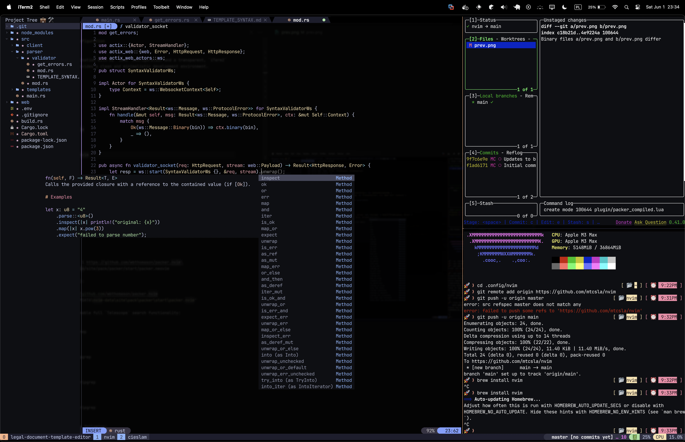

# My personal `neovim` configuration


The configuration in combination with my `tmux` configuration and a transparent, `iTerm2` terminal emulator, provides a clean and minimalistic development environment.

# Installation
1. Install `nvim`:
    - MacOS:
        ```bash
        brew install nvim
        ```
    - Arch Linux:
        ```bash
        sudo pacman -S nvim
        ```
    - Ubuntu:
        ```bash
        sudo apt install nvim
        ```
    - Fedora:
        ```bash
        sudo dnf install nvim
        ```

2. Clone this repository to `~/.config/nvim`:
    ```bash
    git clone https://github.com/mtcsla/nvim.git ~/.config
    ```

3. Install `packer.nvim`:


    - Linux/macOS:
        ```bash
        git clone --depth 1 https://github.com/wbthomason/packer.nvim\
        ~/.local/share/nvim/site/pack/packer/start/packer.neovim
        ```
    - Windows (PowerShell):
        ```powershell
        git clone https://github.com/wbthomason/packer.nvim "$env:LOCALAPPDATA\nvim-data\site\pack\packer\start\packer.nvim"
        ```
4. Install `ripgrep` to enable full `Telescope` search functionality:
    - MacOS:
        ```bash
        brew install ripgrep
        ```
    - Arch Linux:
        ```bash
        sudo pacman -S ripgrep
        ```
    - Ubuntu:
        ```bash
        sudo apt install ripgrep
        ```
    - Fedora:
        ```bash
        sudo dnf install ripgrep
        ```

5. Open `nvim` and run the following:
    1. `:source ~/.config/nvim/init.lua`
    2. `:PackerSync`
    3. `:PackerCompile`

    Skip all of the errors encountered by pressing `Enter`/`Return`, they do not affect the installation.

6. Restart `nvim` and enjoy!

#### Optional

7. Enable copilot
Run  `:Copilot auth` and follow the instructions to authenticate your GitHub account.

### Configuration

# LSP Configuration

This installation comes with:
- `lua-language-server`
- `rust-analyzer`
- `pyright`

More can be installed via `:MasonInstall <server>` (see [Mason](https://github.com/williamboman/mason.nvim))

Configuration can be found in `/lua/plugins/lspconfig.lua`. You should add configuration for the servers you want to use in that file (see [nvim-lspconfig](https://github.com/neovim/nvim-lspconfig) for how to do that).

### Keybindings

- `<leader>` is set to `Space`


### General

- `<leader>%` - create vertical split (to the right)
- `<leader>"` - create horizontal split (below)


- `<leader>Q` - close pane (window)
- `<leader>q` - close current buffer

- `Ctrl + [` - move to the next tab (buffer, tab as in `bufferline`)
- `Ctrl + ]` - move to the previous tab (buffer, tab as in `bufferline`)

- `Ctrl + s` - save the current buffer
- `Ctrl + S` - force save the current buffer (`:w!`)

- `K` - trigger `LSP` hover

### Telescope

- `<leader>pf` - search project files (working directory)
- `<leader>gf` - search project files (known by `git`)
- `<leader>gc` - search git commits
- `<leader>gb` - search git branches
- `<leader>gst` - search git status
- `<leader>gsh` - search git stash
- `<leader>lg` - live grep

### NvimTree

- `<leader>e` - toggle `NvimTree` explorer


**All keybindings can be found in `/lua/keymap/init.lua` and plugin config files in `/lua/plugins/`**


